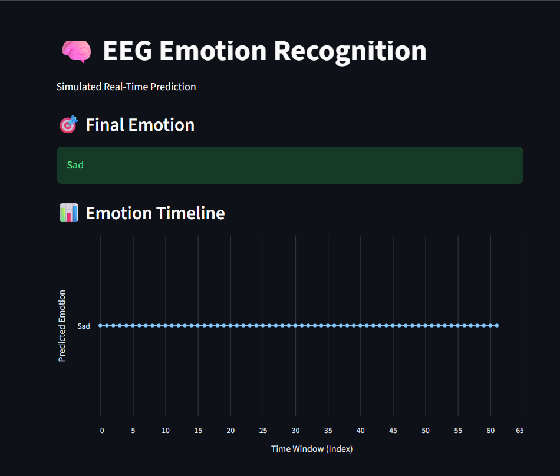
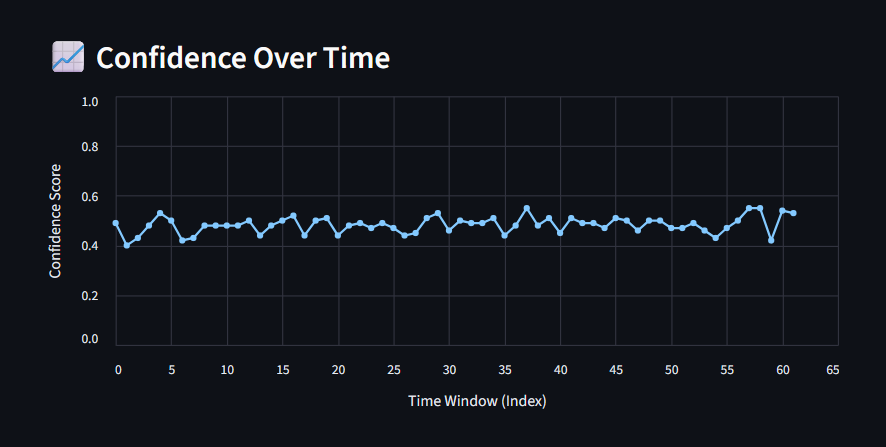

# 🧠 EEG Emotion Recognition using DEAP Dataset

This project explores how EEG (brain signals) can be used to classify emotional states. It uses the DEAP dataset and focuses on mapping signals to the valence-arousal model using frequency-based features.

---

### 🚀 What I Did
- **Loaded EEG data** from the DEAP dataset.
- **Applied Preprocessing**: Bandpass filtering and normalization.
- **Extracted Features**: Mean, variance, and band power (Delta, Theta, Alpha, Beta).
- **Frequency Analysis**: Used PSD (Power Spectral Density) for frequency-domain analysis.
- **Model Training**: Trained a Random Forest classifier.
- **Stabilization**: Used sliding windows and majority voting to stabilize predictions.
- **Visualization**: Built a Streamlit app to visualize results in real-time.

---

### 📊 Emotion Mapping
| Valence | Arousal | Emotion |
|:---:|:---:|:---:|
| High | High | Excited |
| High | Low | Calm |
| Low | High | Stressed |
| Low | Low | Sad |

*Note: Ambiguous samples (4–6 range) were removed.*

---

### 📈 Results & Visualizations
The model achieves approximately **65% accuracy** on the DEAP dataset (subject s01). Predictions become significantly more stable with temporal smoothing.

| Emotion Prediction & Timeline | Confidence Over Time |
|:---:|:---:|
|  |  |

---

### 🛠️ How to Run
1. Install dependencies:
   ```bash
   pip install -r requirements.txt
   ```
2. Run the dashboard:
   ```bash
   streamlit run app.py
   ```
3. Download the DEAP dataset: [DEAP Dataset Link](https://www.eecs.qmul.ac.uk/mmv/datasets/deap/)

---

### ⚠️ Limitations
- **Single Subject**: Trained on subject s01 only (not generalized).
- **Class Imbalance**: Low performance for "Calm" due to fewer samples.
- **Simulated Real-time**: Processes trials iteratively, not via live EEG stream.

---

*This project is part of my exploration into EEG-based analysis and computational neuroscience.*